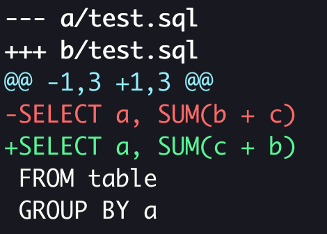
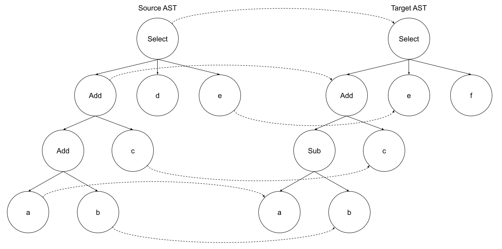
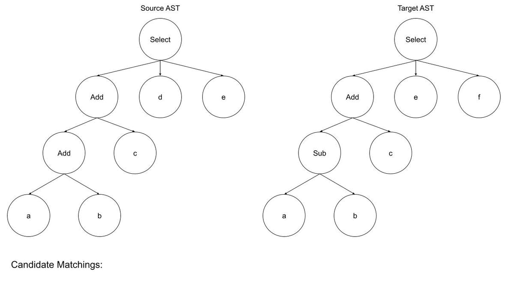
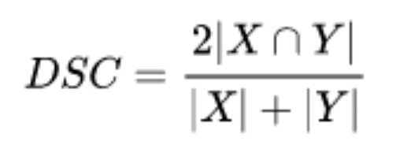
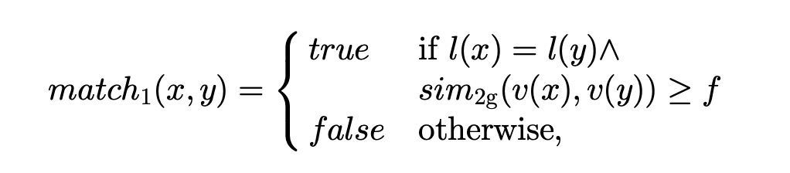
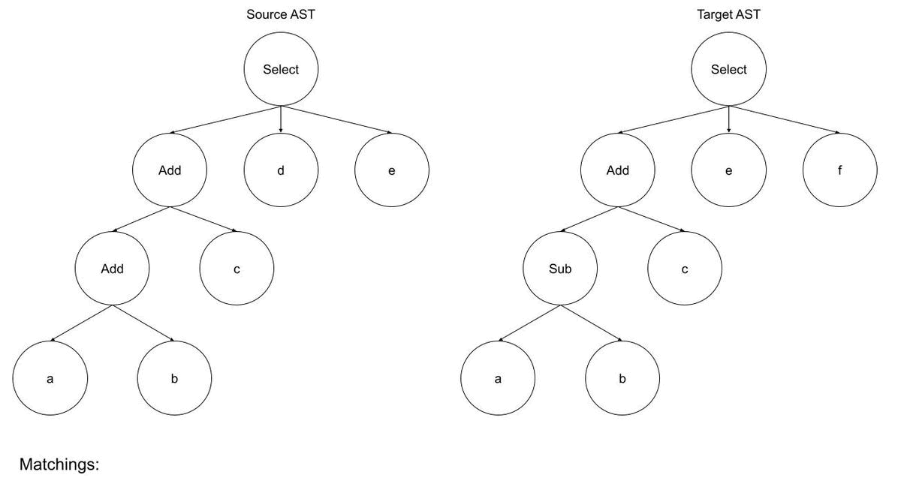
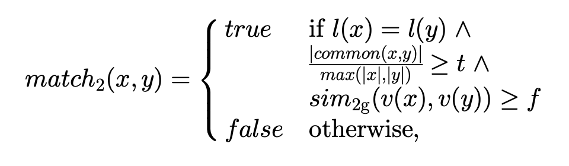

# Semantic Diff for SQL
*by [Iaroslav Zeigerman](https://github.com/izeigerman)*

## Motivation

Software is constantly changing and evolving, and identifying what has changed and reviewing those changes is an integral part of the development process. SQL code is no exception to this.

Text-based diff tools such as `git diff`, when applied to a code base, have certain limitations. First, they can only detect insertions and deletions, not movements or updates of individual pieces of code. Second, such tools can only detect changes between lines of text, which is too coarse for something as granular and detailed as source code. Additionally, the outcome of such a diff is dependent on the underlying code formatting, and yields different results if the formatting should change.

Consider the following diff generated by Git:



Semantically the query hasn’t changed. The two arguments `b` and `c` have been swapped (moved), posing no impact on the output of the query. Yet Git replaced the whole affected expression alongside a bulk of unrelated elements.

The alternative to text-based diffing is to compare Abstract Syntax Trees (AST) instead. The main advantage of ASTs are that they are a direct product of code parsing, which represents the underlying code structure at any desired level of granularity. Comparing ASTs may yield extremely precise diffs; changes such as code movements and updates can also be detected. Even more importantly, this approach facilitates additional use cases beyond eyeballing two versions of source code side by side.

The use cases I had in mind for SQL when I decided to embark on this journey of semantic diffing were the following:

* **Query similarity score.** Identifying which parts the two queries have in common to automatically suggest opportunities for consolidation, creation of intermediate/staging tables, and so on.
* **Differentiating between cosmetic / structural changes and functional ones.** For example when a nested query is refactored into a common table expression (CTE), this kind of change doesn’t have any functional impact on either a query or its outcome.
* **Automatic suggestions about the need to retroactively backfill data.** This is especially important for pipelines that populate very large tables for which restatement is a runtime-intensive procedure. The ability to discern between simple code movements and actual modifications can help assess the impact of a change and make suggestions accordingly.

The implementation discussed in this post is now a part of the [SQLGlot](https://github.com/tobymao/sqlglot/) library. You can find a complete source code in the [diff.py](https://github.com/tobymao/sqlglot/blob/main/sqlglot/diff.py) module. The choice of SQLglot was an obvious one due to its simple but powerful API, lack of external dependencies and, more importantly, extensive list of supported SQL dialects.

## The Search for a Solution

When it comes to any diffing tool (not just a semantic one), the primary challenge is to match as many elements of compared entities as possible. Once such a set of matching elements is available, deriving a sequence of changes becomes an easy task.

If our elements have unique identifiers associated with them (for example, an element’s ID in DOM), the matching problem is trivial. However, the SQL syntax trees that we are comparing have neither unique keys nor object identifiers that can be used for the purposes of matching. So, how do we suppose to find pairs of nodes that are related?

To better illustrate the problem, consider comparing the following SQL expressions: `SELECT a + b + c, d, e` and `SELECT a - b + c, e, f`. Matching individual nodes from respective syntax trees can be visualized as follows:


*Figure 1: Example of node matching for two SQL expression trees.*

By looking at the figure of node matching for two SQL expression trees above, we conclude that the following changes should be captured by our solution:

* Inserted nodes: `Sub` and `f`. These are the nodes from the target AST which do not have a matching node in the source AST.
* Removed nodes: `Add` and `d`. These are the nodes from the source AST which do not have a counterpart in the target AST.
* Remaining nodes must be identified as unchanged.

It should be clear at this point that if we manage to match nodes in the source tree with their counterparts in the target tree, then computing the diff becomes a trivial matter.

### Naïve Brute-Force

The naïve solution would be to try all different permutations of node pair combinations, and see which set of pairs performs the best based on some type of heuristics. The runtime cost of such a solution quickly reaches the escape velocity; if both trees had only 10 nodes each, the number of such sets would approximately be 10! ^ 2 = 3.6M ^ 2 ~= 13 * 10^12. This is a very bad case of factorial complexity (to be precise, it’s actually much worse - O(n! ^ 2) - but I couldn’t come up with a name for it), so there is little need to explore this approach any further.

### Myers Algorithm

After the naïve approach was proven to be infeasible, the next question I asked myself was “how does git diff work?”. This question led me to discover the Myers diff algorithm [1]. This algorithm has been designed to compare sequences of strings. At its core, it’s looking for the shortest path on a graph of possible edits that transform the first sequence into the second one, while heavily rewarding those paths that lead to longest subsequences of unchanged elements. There’s a lot of material out there describing this algorithm in greater detail. I found James Coglan’s series of [blog posts](https://blog.jcoglan.com/2017/02/12/the-myers-diff-algorithm-part-1/) to be the most comprehensive.

Therefore, I had this “brilliant” (actually not) idea to transform trees into sequences by traversing them in topological order, and then applying the Myers algorithm on resulting sequences while using a custom heuristics when checking the equality of two nodes. Unsurprisingly, comparing sequences of strings is quite different from comparing hierarchical tree structures, and by flattening trees into sequences, we lose a lot of relevant context. This resulted in a terrible performance of this algorithm on ASTs. It often matched completely unrelated nodes, even when the two trees were mostly the same, and produced extremely inaccurate lists of changes overall. After playing around with it a little and tweaking my equality heuristics to improve accuracy, I ultimately scrapped the whole implementation and went back to the drawing board.

## Change Distiller

The algorithm I settled on at the end was Change Distiller, created by Fluri et al. [2], which in turn is an improvement over the core idea described by Chawathe et al. [3].

The algorithm consists of two high-level steps:

1. **Finding appropriate matchings between pairs of nodes that are part of compared ASTs.** Identifying what is meant by “appropriate” matching is also a part of this step.
2. **Generating the so-called “edit script” from the matching set built in the 1st step.** The edit script is a sequence of edit operations (for example, insert, remove, update, etc.) on individual tree nodes, such that when applied as transformations on the source AST, it eventually becomes the target AST. In general, the shorter the sequence, the better. The length of the edit script can be used to compare the performance of different algorithms, though this is not the only metric that matters.

The rest of this section is dedicated to the Python implementation of the steps above using the AST implementation provided by the SQLGlot library.

### Building the Matching Set
#### Matching Leaves

We begin composing the matching set by matching the leaf nodes. Leaf nodes are the nodes that do not have any children nodes (such as literals, identifiers, etc.). In order to match them, we gather all the leaf nodes from the source tree and generate a cartesian product with all the leaves from the target tree, while comparing pairs created this way and assigning them a similarity score. During this stage, we also exclude pairs that don’t pass basic matching criteria. Then, we pick pairs that scored the highest while making sure that each node is matched no more than once.

Using the example provided at the beginning of the post, the process of building an initial set of candidate matchings can be seen on Figure 2.


*Figure 2: Building a set of candidate matchings between leaf nodes. The third item in each triplet represents a similarity score between two nodes.*

First, let’s analyze the similarity score. Then, we’ll discuss matching criteria.

The similarity score proposed by Fluri et al. [2] is a [dice coefficient ](https://en.wikipedia.org/wiki/S%C3%B8rensen%E2%80%93Dice_coefficient)applied to [bigrams](https://en.wikipedia.org/wiki/Bigram) of respective node values. A bigram is a sequence of two adjacent elements from a string computed in a sliding window fashion:

```python
def bigram(string):
    count = max(0, len(string) - 1)
    return [string[i : i + 2] for i in range(count)]
```

For reasons that will become clear shortly, we actually need to compute bigram histograms rather than just sequences:

```python
from collections import defaultdict

def bigram_histo(string):
    count = max(0, len(string) - 1)
    bigram_histo = defaultdict(int)
    for i in range(count):
        bigram_histo[string[i : i + 2]] += 1
    return bigram_histo
```

The dice coefficient formula looks like following:



Where X is a bigram of the source node and Y is a bigram of the second one. What this essentially does is count the number of bigram elements the two nodes have in common, multiply it by 2, and then divide by the total number of elements in both bigrams. This is where bigram histograms come in handy:

```python
def dice_coefficient(source, target):
    source_histo = bigram_histo(source.sql())
    target_histo = bigram_histo(target.sql())

    total_grams = (
        sum(source_histo.values()) + sum(target_histo.values())
    )
    if not total_grams:
        return 1.0 if source == target else 0.0

    overlap_len = 0
    overlapping_grams = set(source_histo) & set(target_histo)
    for g in overlapping_grams:
        overlap_len += min(source_histo[g], target_histo[g])

    return 2 * overlap_len / total_grams
```

To compute a bigram given a tree node, we first transform the node into its canonical SQL representation,so that the `Literal(123)` node becomes just “123” and the `Identifier(“a”)` node becomes just “a”. We also handle a scenario when strings are too short to derive bigrams. In this case, we fallback to checking the two nodes for equality.

Now when we know how to compute the similarity score, we can take care of the matching criteria for leaf nodes. In the original paper [2], the matching criteria is formalized as follows:



The two nodes are matched if two conditions are met:

1. The node labels match (in our case labels are just node types).
2. The similarity score for node values is greater than or equal to some threshold “f”. The authors of the paper recommend setting the value of “f” to 0.6.

With building blocks in place, we can now build a matching set for leaf nodes. First, we generate a list of candidates for matching:

```python
from heapq import heappush, heappop

candidate_matchings = []
source_leaves = _get_leaves(self._source)
target_leaves = _get_leaves(self._target)
for source_leaf in source_leaves:
    for target_leaf in target_leaves:
        if _is_same_type(source_leaf, target_leaf):
            similarity_score = dice_coefficient(
                source_leaf, target_leaf
            )
            if similarity_score >= 0.6:
                heappush(
                    candidate_matchings,
                    (
                        -similarity_score,
                        len(candidate_matchings),
                        source_leaf,
                        target_leaf,
                    ),
                )
```

In the implementation above, we push each matching pair onto the heap to automatically maintain the correct order based on the assigned similarity score.

Finally, we build the initial matching set by picking leaf pairs with the highest score:

```python
matching_set = set()
while candidate_matchings:
    _, _, source_leaf, target_leaf = heappop(candidate_matchings)
    if (
        source_leaf in unmatched_source_nodes
        and target_leaf in unmatched_target_nodes
    ):
        matching_set.add((source_leaf, target_leaf))
        unmatched_source_nodes.remove(source_leaf)
        unmatched_target_nodes.remove(target_leaf)
```

To finalize the matching set, we should now proceed with matching inner nodes.

#### Matching Inner Nodes

Matching inner nodes is quite similar to matching leaf nodes, with the following two distinctions:

* Rather than ranking a set of possible candidates, we pick the first node pair that passes the matching criteria.
* The matching criteria itself has been extended to account for the number of leaf nodes the pair of inner nodes have in common.


*Figure 3: Matching inner nodes based on their type as well as how many of their leaf nodes have been previously matched.*

Let’s start with the matching criteria. The criteria is formalized as follows:



Alongside already familiar similarity score and node type criteria, there is a new one in the middle: the ratio of leaf nodes that the two nodes have in common must exceed some threshold “t”. The recommended value for “t” is also 0.6. Counting the number of common leaf nodes is pretty straightforward, since we already have the complete matching set for leaves. All we need to do is count how many matching pairs do leaf nodes from the two compared inner nodes form.

There are two additional heuristics associated with this matching criteria:

* Inner node similarity weighting: if the similarity score between the node values doesn’t pass the threshold “f” but the ratio of common leaf nodes (“t”) is greater than or equal to 0.8, then the matching is considered successful.
* The threshold “t” is reduced to 0.4 for inner nodes with the number of leaf nodes equal to 4 or less, in order to decrease the false negative rate for small subtrees.

We now only have to iterate through the remaining unmatched nodes and form matching pairs based on the outlined criteria:

```python
leaves_matching_set = matching_set.copy()

for source_node in unmatched_source_nodes.copy():
    for target_node in unmatched_target_nodes:
        if _is_same_type(source_node, target_node):
            source_leaves = set(_get_leaves(source_node))
            target_leaves = set(_get_leaves(target_node))

            max_leaves_num = max(len(source_leaves), len(target_leaves))
            if max_leaves_num:
                common_leaves_num = sum(
                    1 if s in source_leaves and t in target_leaves else 0
                    for s, t in leaves_matching_set
                )
                leaf_similarity_score = common_leaves_num / max_leaves_num
            else:
                leaf_similarity_score = 0.0

            adjusted_t = (
                0.6
                if min(len(source_leaves), len(target_leaves)) > 4
                else 0.4
            )

            if leaf_similarity_score >= 0.8 or (
                leaf_similarity_score >= adjusted_t
                and dice_coefficient(source_node, target_node) >= 0.6
            ):
                matching_set.add((source_node, target_node))
                unmatched_source_nodes.remove(source_node)
                unmatched_target_nodes.remove(target_node)
                break
```

After the matching set is formed, we can proceed with generation of the edit script, which will be the algorithm’s output.

### Generating the Edit Script

At this point, we should have the following 3 sets at our disposal:

* The set of matched node pairs.
* The set of remaining unmatched nodes from the source tree.
* The set of remaining unmatched nodes from the target tree.

We can derive 3 kinds of edits from the matching set: either the node’s value was updated (**Update**), the node was moved to a different position within the tree (**Move**), or the node remained unchanged (**Keep**). Note that the **Move** case is not mutually exclusive with the other two. The node could have been updated or could have remained the same while at the same time its position within its parent node or the parent node itself could have changed. All unmatched nodes from the source tree are the ones that were removed (**Remove**), while unmatched nodes from the target tree are the ones that were inserted (**Insert**).

The latter two cases are pretty straightforward to implement:

```python
edit_script = []

for removed_node in unmatched_source_nodes:
    edit_script.append(Remove(removed_node))
for inserted_node in unmatched_target_nodes:
    edit_script.append(Insert(inserted_node))
```

Traversing the matching set requires a little more thought:

```python
for source_node, target_node in matching_set:
    if (
        not isinstance(source_node, LEAF_EXPRESSION_TYPES)
        or source_node == target_node
    ):
        move_edits = generate_move_edits(
            source_node, target_node, matching_set
        )
        edit_script.extend(move_edits)
        edit_script.append(Keep(source_node, target_node))
    else:
        edit_script.append(Update(source_node, target_node))
```

If a matching pair represents a pair of leaf nodes, we check if they are the same to decide whether an update took place. For inner node pairs, we also need to compare the positions of their respective children to detect node movements. Chawathe et al. [3] suggest applying the [longest common subsequence ](https://en.wikipedia.org/wiki/Longest_common_subsequence_problem)(LCS) algorithm which, no surprise here, was described by Myers himself [1]. There is a small catch, however: instead of checking the equality of two children nodes, we need to check whether the two nodes form a pair that is a part of our matching set.

Now with this knowledge, the implementation becomes straightforward:

```python
def generate_move_edits(source, target, matching_set):
    source_children = _get_child_nodes(source)
    target_children = _get_child_nodes(target)

    lcs = set(
        _longest_common_subsequence(
            source_children,
            target_children,
            lambda l, r: (l, r) in matching_set
        )
    )

    move_edits = []
    for node in source_children:
        if node not in lcs and node not in unmatched_source_nodes:
            move_edits.append(Move(node))

    return move_edits
```

I left out the implementation of the LCS algorithm itself here, but there are plenty of implementation choices out there that can be easily looked up.

### Output

The implemented algorithm produces the output that resembles the following:

```python
>>> from sqlglot import parse_one, diff
>>> diff(parse_one("SELECT a + b + c, d, e"), parse_one("SELECT a - b + c, e, f"))

Remove(Add)
Remove(Column(d))
Remove(Identifier(d))
Insert(Sub)
Insert(Column(f))
Insert(Identifier(f))
Keep(Select, Select)
Keep(Add, Add)
Keep(Column(a), Column(a))
Keep(Identifier(a), Identifier(a))
Keep(Column(b), Column(b))
Keep(Identifier(b), Identifier(b))
Keep(Column(c), Column(c))
Keep(Identifier(c), Identifier(c))
Keep(Column(e), Column(e))
Keep(Identifier(e), Identifier(e))
```
Note that the output above is abbreviated. The string representation of actual AST nodes is significantly more verbose.

The implementation works especially well when coupled with the SQLGlot’s query optimizer which can be used to produce canonical representations of compared queries:

```python
>>> schema={"t": {"a": "INT", "b": "INT", "c": "INT", "d": "INT"}}
>>> source = """
... SELECT 1 + 1 + a
... FROM t
... WHERE b = 1 OR (c = 2 AND d = 3)
... """
>>> target = """
... SELECT 2 + a
... FROM t
... WHERE (b = 1 OR c = 2) AND (b = 1 OR d = 3)
... """
>>> optimized_source = optimize(parse_one(source), schema=schema)
>>> optimized_target = optimize(parse_one(target), schema=schema)
>>> edit_script = diff(optimized_source, optimized_target)
>>> sum(0 if isinstance(e, Keep) else 1 for e in edit_script)
0
```

### Optimizations

The worst case runtime complexity of this algorithm is not exactly stellar: O(n^2 * log n^2). This is because of the leaf matching process, which involves ranking a cartesian product between all leaf nodes of compared trees. Unsurprisingly, the algorithm takes a considerable time to finish for bigger queries.

There are still a few basic things we can do in our implementation to help improve performance:

* Refer to individual node objects using their identifiers (Python’s [id()](https://docs.python.org/3/library/functions.html#id)) instead of direct references in sets. This helps avoid costly recursive hash calculations and equality checks.
* Cache bigram histograms to avoid computing them more than once for the same node.
* Compute the canonical SQL string representation for each tree once while caching string representations of all inner nodes. This prevents redundant tree traversals when bigrams are computed.

At the time of writing only the first two optimizations have been implemented, so there is an opportunity to contribute for anyone who’s interested.

## Alternative Solutions

This section is dedicated to solutions that I’ve investigated, but haven’t tried.

First, this section wouldn’t be complete without Tristan Hume’s [blog post](https://thume.ca/2017/06/17/tree-diffing/). Tristan’s solution has a lot in common with the Myers algorithm plus heuristics that is much more clever than what I came up with. The implementation relies on a combination of [dynamic programming](https://en.wikipedia.org/wiki/Dynamic_programming) and [A* search algorithm](https://en.wikipedia.org/wiki/A*_search_algorithm) to explore the space of possible matchings and pick the best ones. It seemed to have worked well for Tistan’s specific use case, but after my negative experience with the Myers algorithm, I decided to try something different.

Another notable approach is the Gumtree algorithm by Falleri et al. [4]. I discovered this paper after I’d already implemented the algorithm that is the main focus of this post. In sections 5.2 and 5.3 of their paper, the authors compare the two algorithms side by side and claim that Gumtree is significantly better in terms of both runtime performance and accuracy when evaluated on 12 792 pairs of Java source files. This doesn’t surprise me, as the algorithm takes the height of subtrees into account. In my tests, I definitely saw scenarios in which this context would have helped. On top of that, the authors promise O(n^2) runtime complexity in the worst case which, given the Change Distiller's O(n^2 * log n^2), looks particularly tempting. I hope to try this algorithm out at some point, and there is a good chance you see me writing about it in my future posts.

## Conclusion

The Change Distiller algorithm yielded quite satisfactory results in most of my tests. The scenarios in which it fell short mostly concerned identical (or very similar) subtrees located in different parts of the AST. In those cases, node mismatches were frequent and, as a result, edit scripts were somewhat suboptimal.

Additionally, the runtime performance of the algorithm leaves a lot to be desired. On trees with 1000 leaf nodes each, the algorithm takes a little under 2 seconds to complete. My implementation still has room for improvement, but this should give you a rough idea of what to expect. It appears that the Gumtree algorithm [4] can help address both of these points. I hope to find bandwidth to work on it soon and then compare the two algorithms side-by-side to find out which one performs better on SQL specifically. In the meantime, Change Distiller definitely gets the job done, and I can now proceed with applying it to some of the use cases I mentioned at the beginning of this post.

I’m also curious to learn whether other folks in the industry faced a similar problem, and how they approached it. If you did something similar, I’m interested to hear about your experience.

## References

[1] Eugene W. Myers. [An O(ND) Difference Algorithm and Its Variations](http://www.xmailserver.org/diff2.pdf). Algorithmica 1(2): 251-266 (1986)

[2] B. Fluri, M. Wursch, M. Pinzger, and H. Gall. [Change Distilling: Tree differencing for fine-grained source code change extraction](https://www.researchgate.net/publication/3189787_Change_DistillingTree_Differencing_for_Fine-Grained_Source_Code_Change_Extraction). IEEE Trans. Software Eng., 33(11):725–743, 2007.

[3] S.S. Chawathe, A. Rajaraman, H. Garcia-Molina, and J. Widom. [Change Detection in Hierarchically Structured Information](http://ilpubs.stanford.edu:8090/115/1/1995-46.pdf). Proc. ACM Sigmod Int’l Conf. Management of Data, pp. 493-504, June 1996

[4] Jean-Rémy Falleri, Floréal Morandat, Xavier Blanc, Matias Martinez, Martin Monperrus. [Fine-grained and Accurate Source Code Differencing](https://hal.archives-ouvertes.fr/hal-01054552/document). Proceedings of the International Conference on Automated Software Engineering, 2014, Västeras, Sweden. pp.313-324, 10.1145/2642937.2642982. hal-01054552
